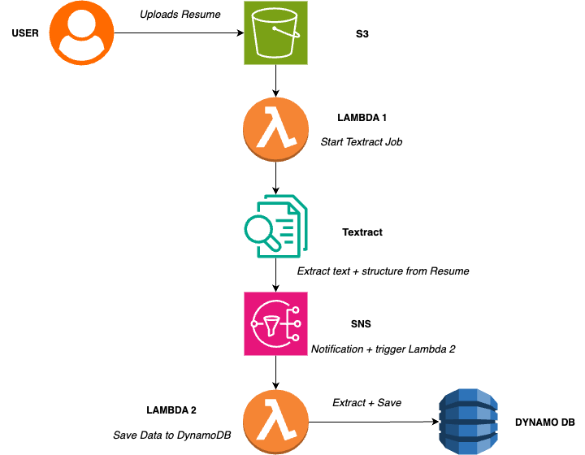

# Resume Auto Parser using AWS

Imagine a busy HR team.
Everyday they receive hundreds of resumes in their mailbox.
Opening each file, reading line by line, and searching for skills, experience, or education takes a lot of time.

So I thought – “Can cloud help HR people save time?”
The answer was Yes! 

So, I created a small automation where resumes are uploaded to the cloud and skills get auto-extracted in seconds.

# How It Works

Upload Resume
The HR (or anyone) uploads a resume file (PDF) into an S3 bucket.

Lambda Function 1
As soon as the file is uploaded, Lambda gets triggered.
This function calls Amazon Textract to read the resume text.

Amazon Textract
Textract uses machine learning to understand the text inside the resume (skills, education, experience).

SNS + Lambda Function 2
Textract sends the extracted text through SNS to another Lambda.
This Lambda cleans the data and saves important details.

DynamoDB
The cleaned resume details (like candidate name, email, skills) are stored in a DynamoDB table for quick search.

# Why This Matters

1. HR teams save hours of manual reading.
2. Candidate skills are available in a database instantly.
3. Searching resumes becomes super fast.
4. It shows how AI + Cloud can solve real business problems.
